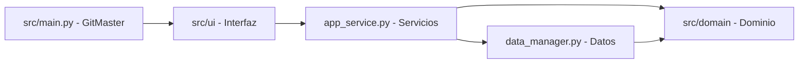

# Arquitectura Prevista

Diagrama del scaffold. No implica que los casos de uso esten implementados.
El GitMaster integrara los aportes Mermaid individuales al finalizar los PRs.

```mermaid
flowchart LR
    Main["src/main.py - GitMaster"] --> UI["src/ui - Interfaz"]
    UI --> Service["app_service.py - Servicios"]
    Service --> Data["data_manager.py - Datos"]
    Service --> Domain["src/domain - Dominio"]
    Data --> Domain
```
